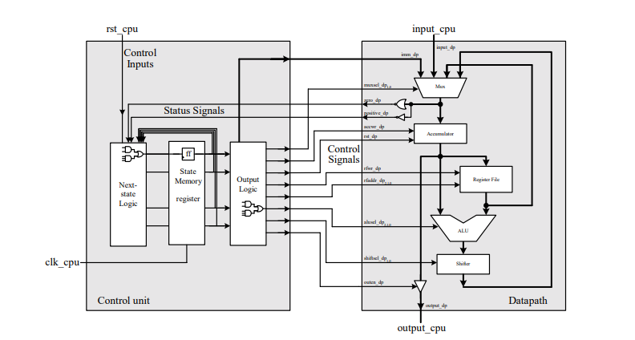

<h1 align="center">General Microprocessor</h1>

&nbsp;&nbsp;&nbsp;&nbsp; This <a target="_blank" href="https://en.wikipedia.org/wiki/Accumulator_(computing)">accumulator microprocessor<a> was built during the <b>Computer Organization and Architecture</b> from <a href="https://www.icmc.usp.br/" target="_blank">ICMC</a> discipline and is completely based on what was taught on one compressed version of the <a target="_blank" href="https://www.amazon.com.br/Digital-Logic-Microprocessor-Design-VHDL/dp/0534465935">Digital Logic and Microprocessor Design with VHDL - Enoch O Hwang</a> book. Moreover, it was done for study purpose.

 

<h2 align="center">Specifications</h2>

- 27 Instructions
- 8 Registers (Besides the accumulator), each 8-bits wide
- 32 bytes, each 8-bits wide, of program memory

 

<h2 align="center">Architecture</h2>

<h1 align="center"></h1>

 

<h2 align="center">Instructions set</h2>

<h3 align="center">Data movement instructions</h3>

| Instruction      | Encoding                 | Operation      | Comment                                                                |
| ---------------- | ------------------------ | -------------- | ---------------------------------------------------------------------- |
| `LDA A,rrr`      | 0001 0rrr                | A <= R[rrr]    | Load accumulator from register                                         |
| `STA rrr,A`      | 0010 0rrr                | R[rrr] <= A    | Load register from accumulator                                         |
| `LDM A,aaaaaa`   | 0011 0000   00 aaaaaa | A <= M[aaaaaa] | Load accumulator from memory                                           |
| `STM aaaaaa,A`   | 0100 0000   00 aaaaaa | M[aaaaaa] <= A | Load memory from accumulator                                           |
| `LDI A,iiiiiiii` | 0100 0000   iiiiiiii  | A <= iiiiiiii  | Load accumulator with intermediate value (iiiiiiii is a signed number) |

<h3 align="center">Jump instructions</h3>

| Instruction     | Encoding                 | Operation                                                                                                                                    | Comment                                                              |
| --------------- | ------------------------ | -------------------------------------------------------------------------------------------------------------------------------------------- | -------------------------------------------------------------------- |
| `JMP absolute`  | 0110 0000   00 aaaaaa | PC <= aaaaaa                                                                                                                                 | Absolute unconditional jump                                          |
| `JMP relative`  | 0110 smmm                | IF (smmm != 0) THEN   &nbsp;&nbsp;&nbsp;&nbsp; IF (s == 0) THEN PC = PC + mmm   &nbsp;&nbsp;&nbsp;&nbsp; ELSE PC = PC - mmm            | Relative unconditional jump (smmm is a sign and magnitude format)    |
| `JZ absolute`   | 0111 0000   00 aaaaaa | IF (A == 0) THEN PC = aaaaaa                                                                                                                 | Absolute jump if A is zero                                           |
| `JZR absolute`  | 0111 smmm                | IF (A == 0 and smmm != 0) THEN   &nbsp;&nbsp;&nbsp;&nbsp; IF (s == 0) THEN PC = PC + mmm   &nbsp;&nbsp;&nbsp;&nbsp; ELSE PC = PC - mmm | Relative jump if A is zero (smmm is a sign and magnitude format)     |
| `JNZ absolute`  | 1000 0000   00 aaaaaa | IF (A != 0) THEN PC = aaaaaa                                                                                                                 | Absolute jump if A is not zero                                       |
| `JNZR relative` | 1000 smmm                | IF (A != 0 and smmm != 0) THEN   &nbsp;&nbsp;&nbsp;&nbsp; IF (s == 0) THEN PC = PC + mmm   &nbsp;&nbsp;&nbsp;&nbsp; ELSE PC = PC - mmm | Relative jump if A is not zero (smmm is a sign and magnitude format) |
| `JP absolute`   | 1001 0000   00 aaaaaa | IF (A > 0) THEN PC = aaaaaa                                                                                                                  | Absolute jump if A is positive                                       |
| `JPR absolute`  | 1000 smmm                | IF (A > 0 and smmm != 0) THEN   &nbsp;&nbsp;&nbsp;&nbsp; IF (s == 0) THEN PC = PC + mmm   &nbsp;&nbsp;&nbsp;&nbsp; ELSE PC = PC - mmm  | Relative jump if A is positive (smmm is a sign and magnitude format) |

<h3 align="center">Arithmetic and logical instructions</h3>

| Instruction | Encoding  | Operation           | Comment                       |
| ----------- | --------- | ------------------- | ----------------------------- |
| `AND A,rrr` | 1010 0rrr | A <= A AND R[rrr]   | Accumulator and register      |
| `OR A,rrr`  | 1011 0rrr | A <= A OR R[rrr]    | Accumulator or register       |
| `ADD A,rrr` | 1100 0rrr | A <= A + R[rrr]     | Accumulator + register        |
| `SUB A,rrr` | 1101 0rrr | A <= A - R[rrr]     | Accumulator - register        |
| `NOT A`     | 1110 0000 | A <= NOT A          | Inverts the accumulator       |
| `INC A`     | 1110 0001 | A <= A + 1          | Increments the accumulator    |
| `DEC A`     | 1110 0010 | A <= A - 1          | Decrements the accumulator    |
| `SHFL A`    | 1110 0011 | A <= A << 1         | Shifts the accumulator left   |
| `SHFR A`    | 1110 0100 | A <= A >> 1         | Shifts the accumulator right  |
| `ROTR A`    | 1110 0101 | A <= RotateRight(A) | Rotates the accumulator right |

<h3 align="center">Input / Output and Miscellaneous</h3>

| Instruction | Encoding  | Operation    | Comment                 |
| ----------- | --------- | ------------ | ----------------------- |
| `IN A`      | 1111 0000 | A <= input   | Input to accumulator    |
| `OUT A`     | 1111 0001 | output <= A  | Output from accumulator |
| `HALT`      | 1111 0010 | Halt         | Halt execution          |
| `NOP`       | 0000 0000 | No operation | No operation            |
